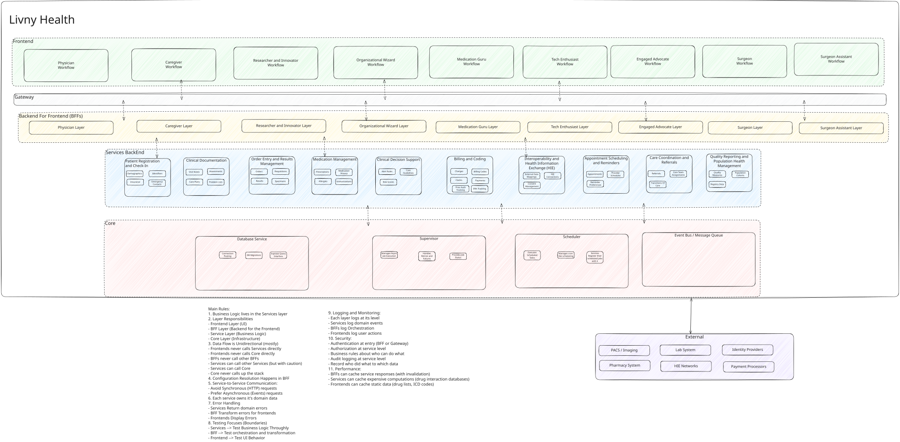

# Livny Health
LivNy (Life New) Health - Rethinking, rebuilt, relaxed EHR

## Quick Start (Docker)

The easiest way to run the app - only requires [Docker Desktop](https://www.docker.com/products/docker-desktop/).

```bash
# Start everything
docker compose up

# Or use make
make docker
```

Then open http://localhost:5173 in your browser.

To stop: `Ctrl+C` or `docker compose down`

## Development Setup

For local development with hot reload (requires Node.js, Python, uv):

```bash
make install  # Install dependencies
make dev      # Start all services
```

## Architecture High Level



